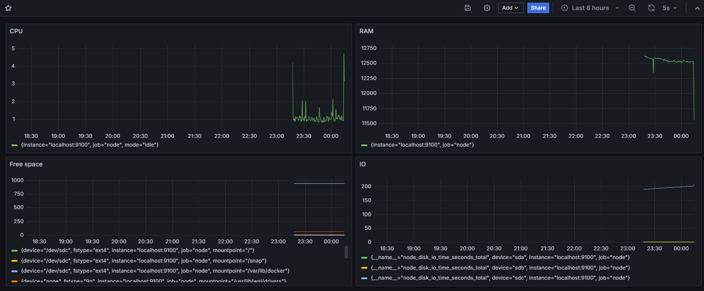

# Создадим Dashboard

#### 1. И добавим в него метрики(ЦПУ, доступной оперативной памяти, свободное место и кол-во операций ввода/вывода на жестком диске.)

#### 2. После запуска скрипта из части 2

#### 3. После запуска утилиты stress
