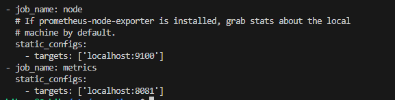
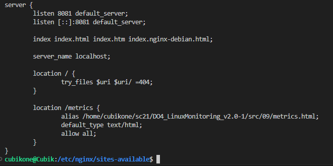
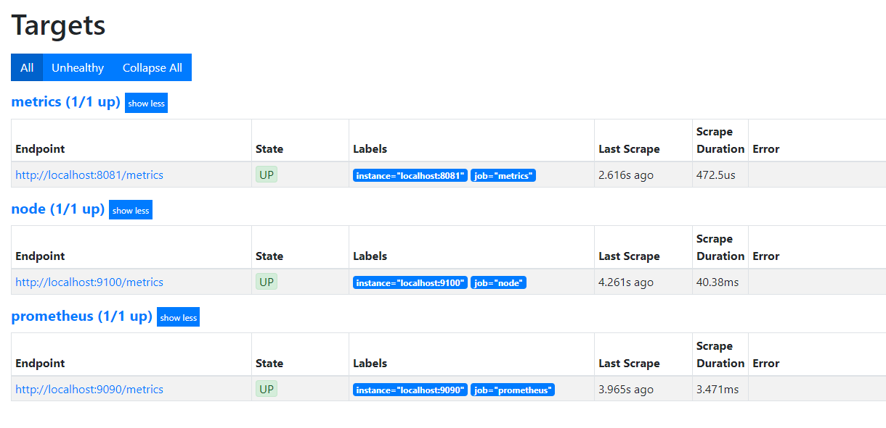
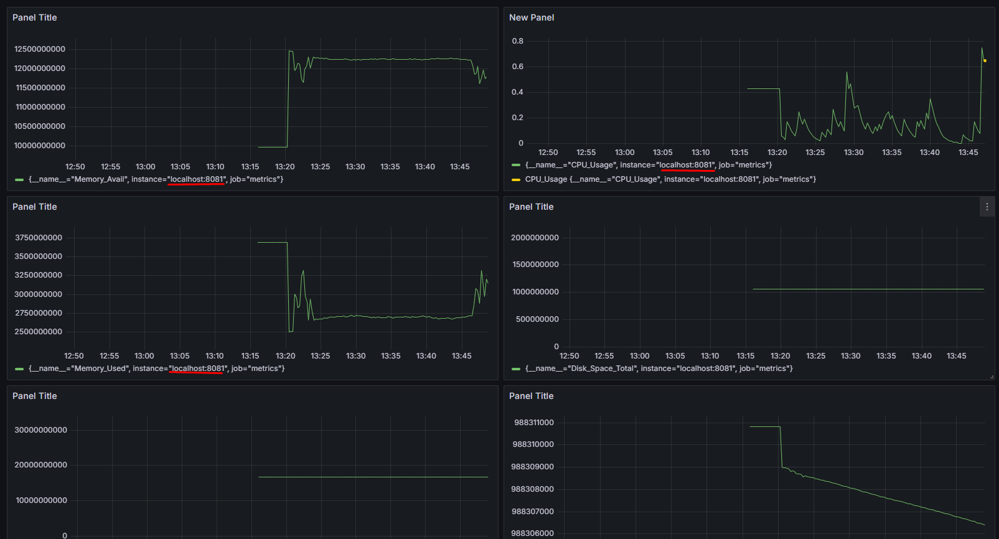
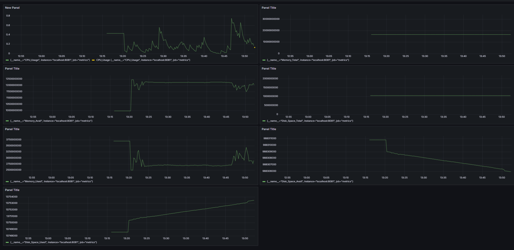
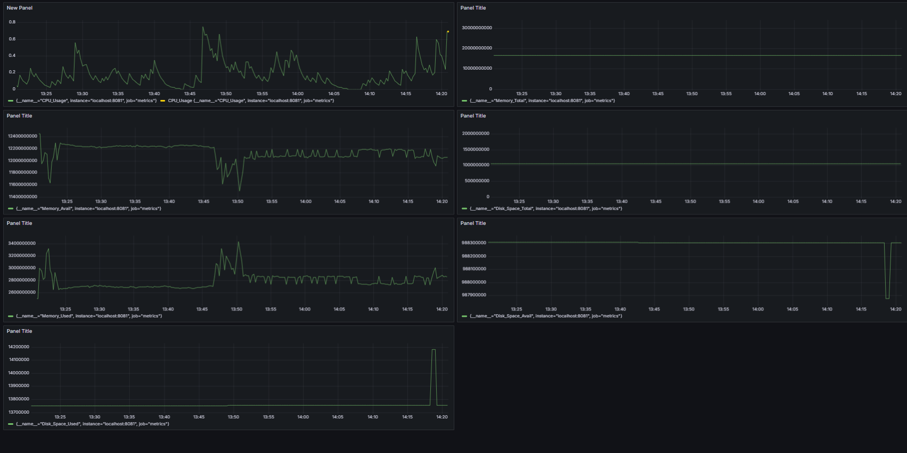

# Свой node_exporter

#### 1. Меняем конфиг файл Prometheus, чтобы он собирал информацию с созданной  странички.

#### 2. Меняем конфиг Nginx

#### 3. В прометеусе смотрим, что всё успешно поднялось

#### 4. Добавляем в дашборд новые панели, которые берут данные с localhost:8081

#### 5. После запуска скрипта из части 2

#### 6. После запуска утилиты stress
